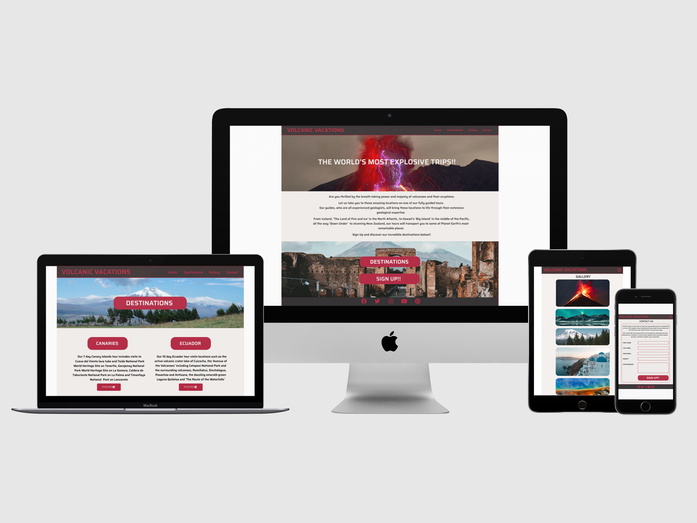

# Volcanic Vacations

## Code Institute: Milestone Project 1

*Volcanic Vacations* is a fictional volcano adventure holiday site that offers fully guided trips to volcanoes and volcanic zones around the world.

The initial idea to produce this site for my Milestone Project 1 stems from my life long passion for all subjects related to our planet, such as volcanoes, earthquakes and the weather. This interest eventually led me to complete a 7 year remote learning degree in Geosciences with the Open University.

I have also travelled on a volcano holiday myself to Sicily with an existing volcano tour operator. Having booked through their website I thought it would be a challenge to see if I could produce a site to my own design.

This is the first of four Milestone Projects that are required as part of the Full Stack Web Development Program with *The Code Institute*.
The essential requirements for this prject were to produce a  static website with a minimum of three pages that is fully responsive from mobile up to large screen sizes, using HTML5 and CSS3.

## Table of contents

- [**UX**](#UX)
    - [Main objectives](#Main-objectives)
    - [User Stories](#User-Stories)
    - [Design Process](#Design-Process)
    - [Project Wireframes](#Project-Wireframes)
- [**Features**](#Features)
    - [Existing features](#Existing-features)
    - [Features consistent across all four pages](#Features-consistent-across-all-four-pages)
    - [Home](#Home)
    - [Destinations](#Destinations)
    - [Gallery](#Gallery)
    - [Contact](#Contact)
    - [Features to implement in the future](#Features-to-implement-in-the-future)
- [**Technologies used**](#Technologies-used)
- [**Testing**](https://github.com/mkthewlis/hotel-eko/blob/master/testing.md)
    - [Testing user stories](#Testing-user-stories)
    - [Validating my HTML and CSS code](#Validating-my-HTML-and-CSS-code)
    - [Testing responsiveness](#Testing-responsiveness)
    - [Issues found](#Issues-found)
- [**Deployment**](#Deployment)
    - [Deploying my project](#Deploying-my-project)
- [**Credits**](#Credits)
    - [Content](#Content)
    - [Media](#Media)
    - [Acknowledgements](#Acknowledgements)

## UX

### Main Objectives

- To create a website that instantly appeals to the visitor and offers exciting trips to geology enthusiasts and other interested travellers

- To create a website that offers a wide range of destinations with evocative descriptions to entice potential clients to book

- To create a website visually appealing and intuitive for visitors to navigate

- To create a website that is fully responsive on all screen sizes and all devices

### User Stories

1. I am a geological professional who enjoys visiting locations away from my geology day job to further my knowledge and to enjoy the power of our planet in a relaxed setting. I also want to use a website that is easy to navigate and allows me to find the information I need without taking too much time from my busy working day. I am most likely to visit the website using a workplace laptop or desktop.

2. I am a geology enthusiast or amateur with a passion and good knowledge of all things geology related. I am always looking for exciting and immersive ways to further my passion, including vacations to volcanic locations around the world. I also enjoy using websites that are visually appealing and easy to navigate to the information I require. I am most likely to visit the website using a phone, laptop, or tablet.

3. I have a general interest in geology and volcanoes and am always seeking out new ways to increase my knowledge. Trips to exciting locations are of great interest to me as I know I will be with people will furnish me new concepts which increase my enjoyment of the subjects. An intuitive experience is a must. I am most likely to visit the website using a phone, laptop, or tablet.

4. We members of a geological society or group who have good knowledge of the subject but are always looking to find new locations to visit. We book and travel as a group and look for trips that can cater for this requirement. A good user experience will encourage us to folow through with a booking. We are most likely to visit the website using a laptop or desktop owned by the society/group.

5. We are a school or university group learning about volcanoes and geology. We are interested in booking exclusive tours that cater solely for out group due to the large numbers we are likely to have. A smmoth user experience that allows us to seamlessly book for large groups is essentail. We are most likely to visit the website using a laptop or desktop owned by the school or university.

6. 50% of visitors to the website are expected to be comprised of a retired age as this demographic has more desposible income and time to travel on our type of trips. 25% is expected to be couples and single travellers from the 30 to 65 age range and the final 25% will be a mix of geological societies, groups, school and university trips.

### Design Process

1. The first step I undertook in my design process was to identify the essential pages that I wanted my website to have. I considered how to structure my website to make it a pleasant experience for the end user. This led me to deciding on a four page website. The pages I decided to include were: 'Home', 'Destinations', 'Gallery' and 'Contact'.

2. The first design decision was to include a striking header navigation bar section which would contain the site name and the page links at the top of each page. I decided this header would need to be fully responsive and that the links would collapse into a burger icon on smaller devices and screen sizes.
Each page would also have a footer which would contain social media icons.

3. I decided to keep the home page as clean as possible. To do this I divided the main area of the page into three sections. The first of the sections contains a hero image with a centered tagline. I used [this image](https://unsplash.com/photos/VbP9v1rh-sc) a striking one showing volcanic lightning which I found on [Unsplash](https://unsplash.com/). The central section contains introduction text explaining the services that the website has set out to fulfill. The lower section contains a second hero image. I used [this image](https://unsplash.com/photos/h5cYy5OHDWM) also from [Unsplash](https://unsplash.com/), overlain by large buttons which link to the destinations page and the contact page. I thought that using these large buttons would provide an obvious and quick way to navigate to these pages.

4. I began a new workspace on [Figma](https://www.figma.com/file/WvstHcIHxZ5BpOl5wDqMQn/Milestone-Project-01_Volcanic-Vacations?node-id=0%3A1) and started to create a number of experimental wireframes to see if I could decide on a final layout for my four pages. I tried using different layouts for each page until I was happy with the layout I eventually coded. I also looked at using a number of different colour combinations before finally deciding to use the following combinations: 
- (#e5e5e5) overall website background colour
- (#2f2d2e) all site text not in header or footer, header and footer background colour
- (#b02841) header and footer text and icons, all buttons background colour
- (#f3f0ee) home page tagline text, all buttons text
- (#c73c32) hover colour for clickable buttons
- (lightgrey) background colour for contact form sign up button

    After experimenting with a number of font styles I finally decided to use one font style throughout the website. The font style that I thought best complimented my site was Saira Semi Bold.

5. I continued to make adjustments and enhancements to my layout throughout the design process, including layout, photographic content, text content and what features that I had initially planned would be implemented and which would be omitted to a later date.

### Project wireframes

Design for desktop devices:

Design for tablet devices:

Design for mobile devices:

[The entire workspace can be viewed on Figma with this link.](https://www.figma.com/file/WvstHcIHxZ5BpOl5wDqMQn/Milestone-Project-01_Volcanic-Vacations?node-id=0%3A1)

## Features

### Existing Features

This website has four seperate pages. Each page can be accessed by clicking on the relevant page name on the link menu located within the navigation bar at the top right corner of the home page. On smaller devices and screens sizes they can be accessed within the burger icon menu.

#### Features consistent across all four pages

- A navigation bar header with the *Volcanic Vacations* logo in the top left corner (leads user back to the home page when clicked) and links to each page in the top right corner of the page. These links are "Home', 'Destinations', 'Gallery' and 'Contact'.

- A footer at the bottom of all four pages. This footer contains five social media icons, namely 'Facebook', 'Twitter, 'Instagram', 'YouTube' and 'Pinterest'. When clicked each of these social media icons will open the relevant external website in a new tab, thus preventing the user from navagating away from the 'Volcanic Vacations' website.

#### Home
- The top hero image contains a bold website tagline.
- The introduction text vividly describes the 'why' of the website.
- The bottom hero image contains striking and large link buttons with a hover effect that lead the user to the 'Destinations' and 'Contact' pages. 

#### Destinations
- A [hero image](https://unsplash.com/photos/A24aX-QwTZk) sourced from [Unsplash](https://unsplash.com/) dominates the top of this page. A bold destinations button is located centrally. This button has been disabled and does not link to anything.
- Nine location description sections arranged in three rows of three locations each. The first row is for the European locations, the second for the North ans South America locations, and the third for the Asia and Oceania locations.
- Each of the nine location description sections also contain a bold heading within a disabled button and a enquire/book button, which when clicked will take the user to the contact page.

#### Gallery
- The gallery page contains a selection of volcano photographs from the locations which are listed on the 'Destinations' page. The column count will responsively change between different device and screen sizes.

#### Contact
- The contact page contains a form where users can enquire about the available trips and also sign up to the Volcanic Vacations monthly newsletter. The form alters responsively between different device and screen sizes.

### Features to implement in the future

In the future I would look to add more trip locations to the destinations page, such as Costa Rica, Santorini and Alaska.

I initially wanted to include a Tours page which would give dates and prices for each of the available locations. I found this page to be too busy and complicated for my website at the present time and it's inclusion would not have provided a good user experience. Therefore at this time I have decided not to included it. I may at some future point look to add this page again.

Although beyond the scope of this project I believe an extra feature that would enhance the website would be the addition of videos of previous trips. This I feel would really help to sell these locations and trips to future clients

## Technologies used

- HTML5
    * The coding language that is utilised to structure the overall content of the website.

- CSS3  
    * The coding language that is utilised to style the HTML5 elements in accordance with the font styles, colours and layouts selected.

- [Bootstrap 4](https://getbootstrap.com/) 
    * I utilised bootstrap to create my responsive navigation bar, to create a grid container layout and also to create my contact form.

- [Figma](https://www.figma.com)
    * Figma was invaluable in helping me to create all my wireframes, from initial concept, through to a final completed design.

- [Google Fonts](https://fonts.google.com/)
    * Google Fonts was my source for choosing my overall font style for my website.

- [FontAwesome](https://fontawesome.com/) 
    * My five social media links located in my footer section are sourced from FontAwesome.

- [Unsplash](https://fontawesome.com/) 
    * Unsplash was the source for my three hero images. A number of the gallery images were also from this website of freely usable images.
    
- [Pexels](https://www.pexels.com/) 
    * Pexels was the source for a number of the gallery images, another website of freely usable images.

- [TinyPNG](https://tinypng.com/) 
    * I used TinyPNG to compress image files to try to improve the loading time for each page, especially the gallery page.

- [W3C Markup Validation Service](https://validator.w3.org/) 
    * I used this tool throughout the project to test the validity of my HTML and CSS code.  

- [W3C Schools](https://www.w3schools.com/)
    * I've refered to WSC Schools frequently during the evolution of my project

- [CodePen](https://codepen.io/) 
    * I used CodePen to discover code examples which I could utilise within my website.

  ### Non technological sources of help, guidance and inspiration  

- [Stack Overflow](https://stackoverflow.com/)
    * When unsure of a certain piece of HTML or CSS this website was a great source of help.

- [Google](https://www.google.co.uk/)
    * Found myself asking all kinds of questions on Google. Was able to find a link to an answer most of the time.

- [YouTube](https://www.youtube.com/)
    * I watched numerous video tutorials on HTML, CSS and Bootstrap 4 throughout the duration of my project.

## Testing

### Testing User Stories

Based on my User Stories detailed earlier:

1. The geological professional - they would be able to easily navigate the site to discover the trips and how to book through the contact form. The website would render well on a large screen.

2. The geology enthusiast or amateur - navigating the website to find a suitable trip and enquiring and booking that trip would be simple. The site will render well on the smaller devices and screens they may be using.

3. A general interest in geology - this group might be less willing to look around the website. The website must try to hook them in with bold photographs and descriptions.

4. The geological society or group - they need to be able to enquire about a trip easily and be able to book for multiple people at the same time.

5. The school or university group - this group requires an extra educational aspect to theit trips. The site should emphasise that the expertise of their guides can fulfill this requirement. 

### Validating my HTML and CSS code

I tested my four HTML code files (index.html, destinations.html, gallery.html, contact.html) by using the following validation service: 
- HTML: [W3C Markup Validation Service](https://validator.w3.org/)

I tested my CSS code file (style.css) by using the following validation service:
- CSS: [W3C Markup Validation Service](https://jigsaw.w3.org/css-validator/)

### Testing different browsers

I manually tested my website on the following web browsers, checking that the navigation bar, buttons, socila media icons, responsiveness and design worked as intended:
- Google Chrome 
- Mozilla Firefox 
- Apple Safari

### Testing responsiveness

I manually tested the live project by doing the following:

- Using Google Developer Tools to view the project on devices with different screen sizes. The devices on which the responsiveness was tested are as follows:
- iPhone 5 and SE 
- iPhone 6, 7 and 8 
- iPhone 6 Plus, 7 Plus and 8 Plus 
- iPhone X
- Samsung Galaxy S5
- iPad Mini, iPad and iPad Pro
- Laptop with MDPI screen
- Laptop with HiDPI screen

### Issues found

I found a couple problems with the responsiveness of my website on different devices and screen sizes at different points of the devepolment process. Firstly, some buttons were overflowing their parent containers. Secondly, the gallery was reluctant to change from three to two columns on mobile devices.
These issues were eventually corrected with the help of students, tutors and mentors on the Slack Community.

## Deployment

### Deploying my project 

I created my Milestone Project 1 on GitHub and used GitPod's development environment to write my HTML and CSS code. 

So that my project was viewable to others it was then deployed to GitHub Pages using the following process:

1. Opened the 'Settings' section of the project repository in GitHub.
2. Scrolled to the 'GitHub Pages' section.
3. Selected 'master branch' as the Source.
3. This deployed the project on GitHub Pages and thus enabled me to share the live website with others. 

My live project can be viewed by folowing this link: [Volcanic Vacations](https://sruss07.github.io/MS01-Volcanic-Vacations/)

## Credits

### Content

The content of this website is completely fictional and all code and text is written entirely by myself. The images are from Unsplash and Pexels and are fully referenced below. 

### Media

The following images were sourced from [Unsplash](https://unsplash.com/) and [Pexels](https://www.pexels.com/).

- *Home page* 

  * [Top Hero image](https://unsplash.com/photos/VbP9v1rh-sc)

  * [Bottom Hero image](https://unsplash.com/photos/h5cYy5OHDWM)

- *Destinations page* 

    * [Hero image](https://unsplash.com/photos/A24aX-QwTZk)   

- *Gallery page* 

    * [Gallery image 1](https://unsplash.com/photos/FhnhWwTJk0s)
    * [Gallery image 2](https://www.pexels.com/photo/volcano-erupting-at-night-under-starry-sky-4220967/)
    * [Gallery image 3](https://www.pexels.com/photo/blue-and-green-sky-and-mountain-3617500/)
    * [Gallery image 4](https://unsplash.com/photos/LAey-PFjHBU)
    * [Gallery image 5](https://www.pexels.com/photo/active-ash-cloud-ashes-blaze-417070/)
    * [Gallery image 6](https://www.pexels.com/photo/white-and-blue-concrete-building-near-body-of-water-3727255/)
    * [Gallery image 7](https://unsplash.com/photos/orQBzc7Dl3U)
    * [Gallery image 8](https://unsplash.com/photos/Aduh0KXCI1w)
    * [Gallery image 9](https://unsplash.com/photos/3pC6oFadbF8)
    * [Gallery image 10](https://www.pexels.com/photo/art-boiling-eruption-fog-261397/)
    * [Gallery image 11](https://unsplash.com/photos/LgrGHYZzBSk)
    * [Gallery image 12](https://unsplash.com/photos/WQ5HOvrDZ6Y)

### Acknowledgements

Thank you to the following people who helped me get my project completed on time with support, inspiration and guidance from start to finish:

- My mentor Seun Owonikoko
- Fellow student Miranda Thewlis
- JimLynx_lead on Slack 
- The huge amount of help from the *Code Institute* community on Slack
- My family and friends for their patience and honest suggestions throughout the project